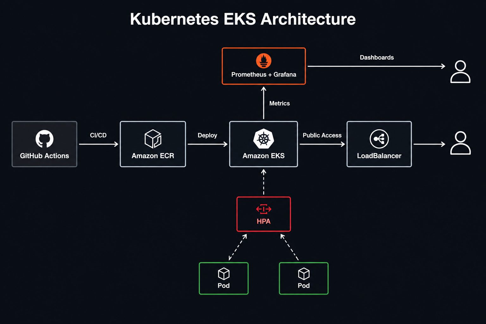

<div align="center">

# Kubernetes Cluster on Amazon EKS with Autoscaling & Observability

**Production-ready Kubernetes cluster with automated CI/CD, horizontal pod autoscaling, and full observability using Prometheus and Grafana.**

[Architecture](#architecture) · [Features](#features) · [Tech Stack](#tech-stack) · [Deployment](#deployment) · [Monitoring](#monitoring) · [Testing](#testing)


</div>

> A Terraform-managed Amazon EKS cluster with automated deployment, horizontal pod autoscaling based on CPU usage, and complete observability through Prometheus and Grafana dashboards.

## Overview

This project implements a production-ready Kubernetes cluster on Amazon EKS with automated CI/CD, horizontal pod autoscaling, and full observability.

The pipeline builds Docker images, scans for vulnerabilities with Trivy, pushes to Amazon ECR, and deploys to EKS on every push to main. The Horizontal Pod Autoscaler scales pods based on CPU usage, while Prometheus and Grafana provide real-time metrics and dashboards.

## Why this project

Modern cloud applications require automated deployment, elastic scaling, and complete observability.

This project demonstrates:

- Automated CI/CD with GitHub Actions.
- Docker image builds and Amazon ECR integration.
- Security scanning with Trivy.
- Kubernetes deployments with multiple replicas.
- Horizontal Pod Autoscaler based on CPU metrics.
- Prometheus and Grafana for observability.
- Terraform-managed EKS infrastructure.
- LoadBalancer service for public access.

## Architecture

The pipeline automates build, scan, and deploy workflows with separate monitoring namespace for observability.



## Features

- Automated CI/CD pipeline with GitHub Actions.
- Docker image build and push to Amazon ECR.
- Security scanning with Trivy on every build.
- Automatic deployment to EKS on every push to main.
- Horizontal Pod Autoscaler based on CPU usage (50% target).
- Multiple replicas for high availability.
- Public LoadBalancer for application access.
- Metrics Server for real-time resource metrics.
- Prometheus and Grafana for complete observability.
- Terraform-managed infrastructure.

## Tech Stack

| Component | Purpose |
|---|---|
| Amazon EKS | Managed Kubernetes control plane |
| Amazon ECR | Docker image registry |
| Kubernetes | Container orchestration |
| Helm | Kubernetes package manager |
| GitHub Actions | CI/CD automation |
| Terraform | Infrastructure as Code |
| Prometheus | Metrics collection |
| Grafana | Visualization and dashboards |
| Trivy | Container security scanning |
| Python Flask | Sample application |

## Security

- Docker images scanned with Trivy on every build.
- IAM roles with least privilege permissions.
- Security groups restrict access to required ports.
- No long-lived AWS credentials in source code.
- Terraform state stored securely outside version control.
- LoadBalancer configured with minimal inbound rules.

## Requirements

- Python 3.11+
- Terraform 1.5+
- kubectl 1.28+
- Helm 3.x
- AWS CLI
- Docker (optional for local testing)
- An AWS account for deployment

## Installation

```bash
git clone https://github.com/tatan461/eks-autoscaling-observability.git
cd eks-autoscaling-observability
```

## Deployment

Terraform configuration is located in `terraform/`.

Create the local variables file:

```bash
cd terraform
cp terraform.tfvars.example terraform.tfvars
```

Initialize, validate, plan, and deploy:

```bash
terraform init
terraform fmt -check
terraform validate
terraform plan -out=tfplan
terraform apply tfplan
```

Review the plan before applying it.

Configure kubectl:

```bash
aws eks update-kubeconfig --region <region> --name <cluster-name>
kubectl get nodes
```

Deploy the application:

```bash
cd ../app
docker build -t <ecr-url>:latest .
docker push <ecr-url>:latest
kubectl apply -f ../k8s/
kubectl get pods
kubectl get svc
kubectl get hpa
```

Install Prometheus and Grafana:

```bash
helm repo add prometheus-community https://prometheus-community.github.io/helm-charts
helm repo update

helm install monitoring prometheus-community/kube-prometheus-stack \
  --namespace monitoring \
  --create-namespace \
  --set grafana.service.type=LoadBalancer

kubectl get pods -n monitoring
```

Access Grafana:

```bash
kubectl get svc -n monitoring monitoring-grafana \
  -o jsonpath='{.status.loadBalancer.ingress[0].hostname}'

# Or use port-forward
kubectl port-forward svc/monitoring-grafana -n monitoring 8080:80
```

**Credentials:**
- **Username:** `admin`
- **Password:** `prom-operator`

Never commit:

```text
terraform.tfvars
*.tfstate
*.tfstate.*
.env
AWS credentials
kubeconfig
```

## Usage

Inspect cluster status:

```bash
kubectl get pods -A
kubectl get svc -A
kubectl get hpa
```

View real-time metrics:

```bash
kubectl top pods
kubectl top nodes
```

View pod logs:

```bash
kubectl logs <pod-name>
kubectl logs -f <pod-name>
```

Access Prometheus:

```bash
kubectl port-forward svc/monitoring-kube-prometheus-prometheus -n monitoring 9090:9090
```

URL: `http://localhost:9090`

## Monitoring

Grafana dashboards available after installation:

- **Kubernetes / Compute Resources / Cluster** - Cluster overview
- **Kubernetes / Compute Resources / Node (Pods)** - Per-node metrics
- **Kubernetes / Compute Resources / Pod** - Per-pod metrics
- **Grafana / Stats** - Grafana statistics

## Testing

Test autoscaling by generating load:

```bash
# Install Apache Bench
sudo apt-get install apache2-utils  # Linux
brew install httpd                  # macOS

# Generate load
ab -n 10000 -c 100 http://<loadbalancer-url>/
```

Monitor scaling in real-time:

```bash
watch kubectl get hpa my-app -n default
watch kubectl get pods -l app=my-app
```

Validate Terraform:

```bash
cd terraform
terraform fmt -check
terraform validate
```

## Project Structure

```text
.
├── .github/
│   └── workflows/
│       └── ci-cd.yml
├── app/
│   ├── Dockerfile
│   ├── app.py
│   └── requirements.txt
├── k8s/
│   ├── deployment.yaml
│   ├── service.yaml
│   └── hpa.yaml
├── terraform/
│   ├── main.tf
│   ├── variables.tf
│   ├── outputs.tf
│   └── ecr.tf
├── helm/
│   └── values.yaml
├── docs/
│   └── architecture.png
├── LICENSE
├── README.md
└── .gitignore
```

## Cleanup

Remove monitoring stack:

```bash
helm uninstall monitoring --namespace monitoring
kubectl delete namespace monitoring
```

Remove application:

```bash
kubectl delete -f k8s/
```

Remove AWS infrastructure:

```bash
cd terraform
terraform destroy
```

**Important:** Make sure to delete all resources to avoid unnecessary costs.

## Lessons Learned

- EKS is powerful but adds operational overhead compared to managed services. For simple workloads, ECS or serverless may be more cost-effective.
- HPA requires Metrics Server to be installed and healthy before scaling based on CPU or memory.
- LoadBalancer security groups are created automatically but may need manual adjustment for external access.
- The full kube-prometheus-stack is resource-intensive. For small clusters, consider lightweight alternatives or managed solutions like Amazon Managed Service for Prometheus.
- Always use remote Terraform state (S3 + DynamoDB) for production EKS clusters to prevent state file loss.

## Documentation

- [Amazon EKS Best Practices](https://docs.aws.amazon.com/eks/latest/best-practices/introduction.html)
- [Kubernetes HPA Documentation](https://kubernetes.io/docs/tasks/run-application/horizontal-pod-autoscale/)
- [Prometheus + Grafana Helm Chart](https://github.com/prometheus-community/helm-charts)

## Author

**Jonathan Angel Gonzalez**  
Junior Cloud Engineer · AWS Certified Specialist

[](https://github.com/tatan461)
[](https://www.linkedin.com/in/jonathan-angel-gonzalez-0543b441a/)

## License

This project is licensed under the [MIT License](LICENSE).